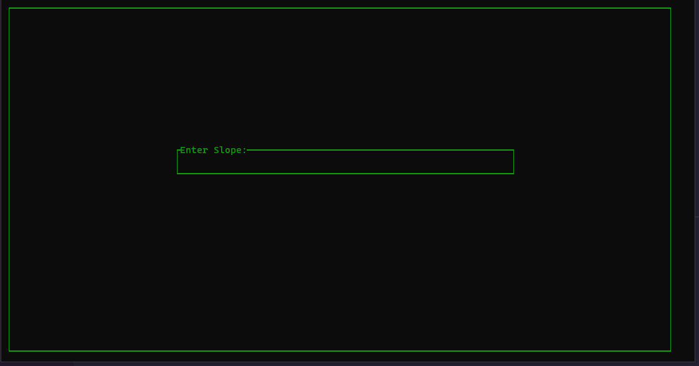

This repository is for sharing my Advent of Code solutions (or attempts).

Advent of Code is a yearly programming puzzle event.

More info here: [Advent of Code - About](https://adventofcode.com/2019/about)

**Terminal IntCode Computer, Day 5, 2019**

**Visualization of Day 6 Orbits, 2019:**

**Visualization of Day 7 Part 2 Network, 2019**

**Visualization of Incoming Transmission, Day 8, 2019**

**AOC19 in the form of Day 8 transmission, 2019**

**Terminal Intcode Computer v2, Day 9, 2019**

**Painting Robot Animation, Day 11, 2019**

**Breaker Animation, Day 13, 2019**

**Maze Solving Animation, Day 15, 2019**

**Maze Solving in 2.5d, Day 15, 2019**

**Skiing, Day 3, 2020**

