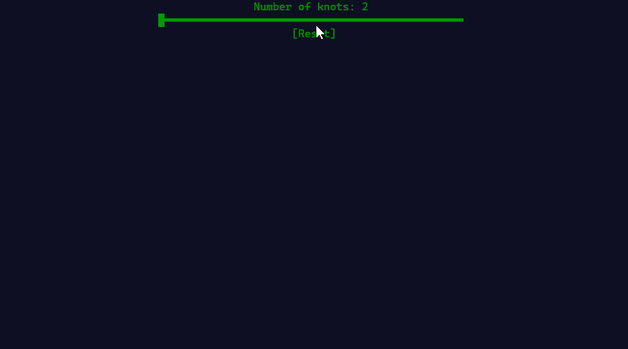
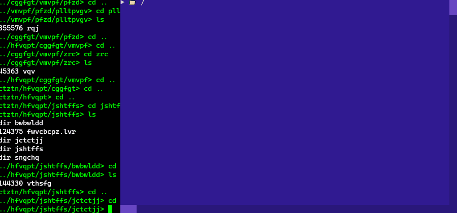
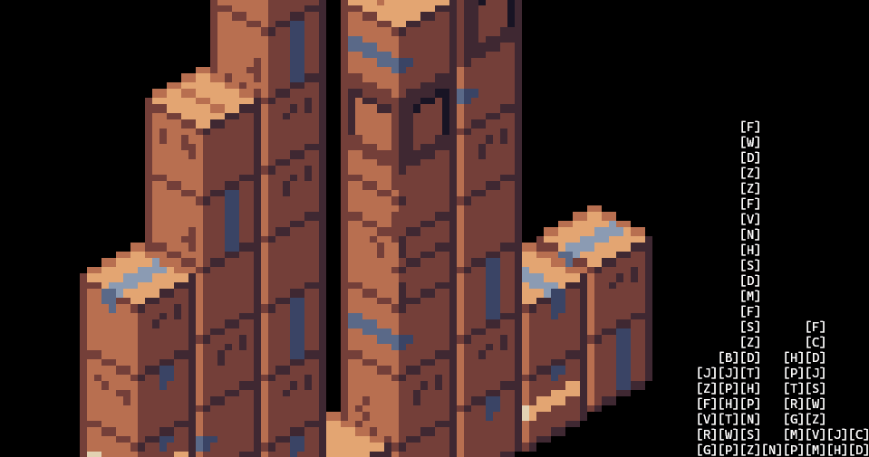
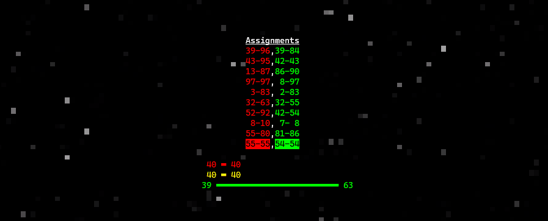
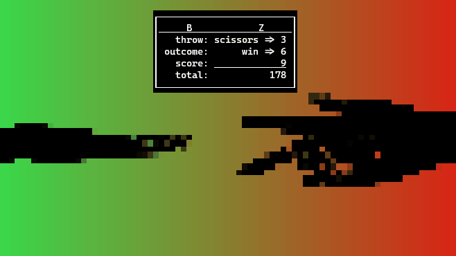
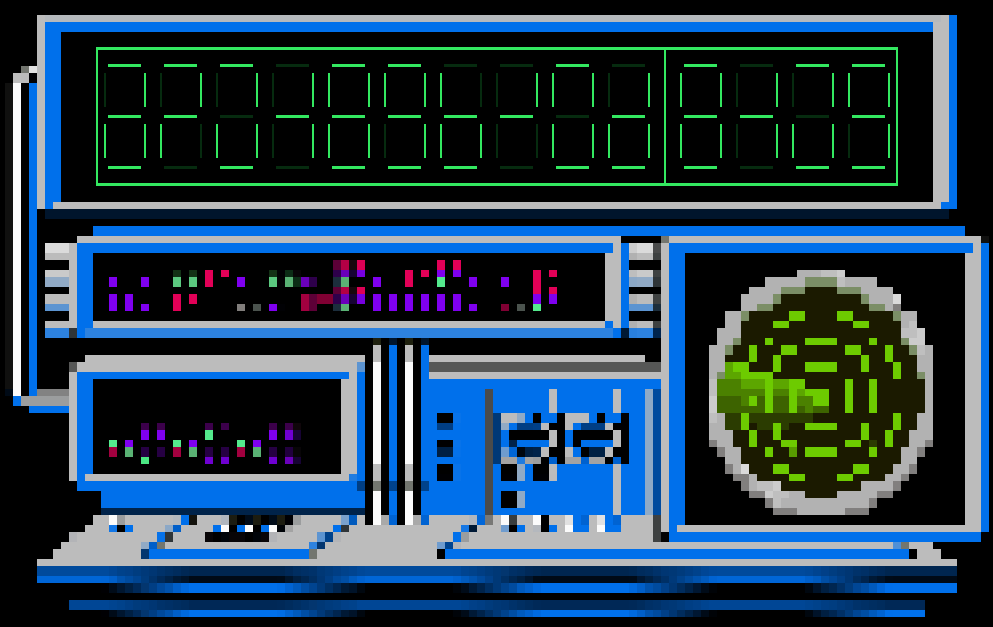
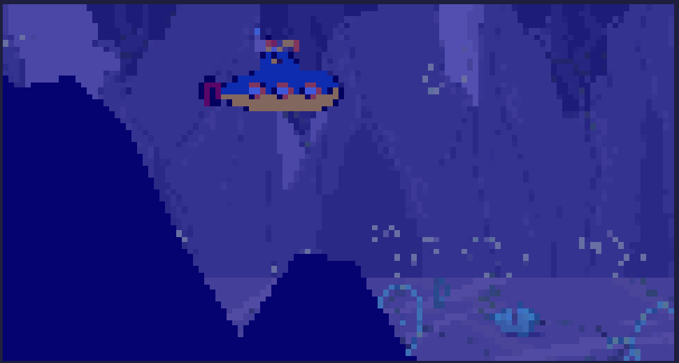
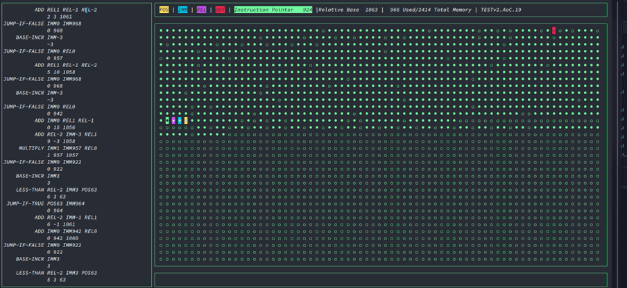

This repository is for sharing my Advent of Code solutions (or attempts) and visualizations.

Advent of Code is a yearly programming puzzle event. More info here: [Advent of Code - About](https://adventofcode.com/2019/about)

Many solutions use a fetch/submit helper that now lives in its own repository: https://github.com/salt-die/aoc_lube.

Several visualizations were created with my terminal graphics library, [nurses_2](https://github.com/salt-die/nurses_2).

# Terminal Visualizations
Check [visuals_media](visuals_media/) for more visualizations.

**Rope Bridge, Day 9, 2022**

**Treetop Tree House, Day 8, 2022**

**No Space No Space Left On Device, Day 7, 2022**

**Supply Stacks, Day 5, 2022**

**Camp Cleanup, Day 4, 2022**

**Rock, Paper, Scissors, Day 2, 2022**

**Counting Calories, Day 1, 2022**

**Dumbo Octopuses, Day 11, 2021**

**Scrambled LED, Day 8, 2021**

**Submarine Commands, Day 2, 2021**

**Ocean Floor, Day 1, 2021**

**Skiing, Day 3, 2020**

**Maze Solving in 2.5d, Day 15, 2019**

**Terminal Intcode Computer v2, Day 9, 2019**

