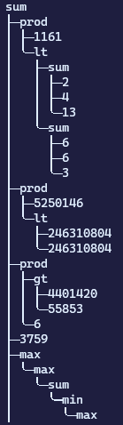
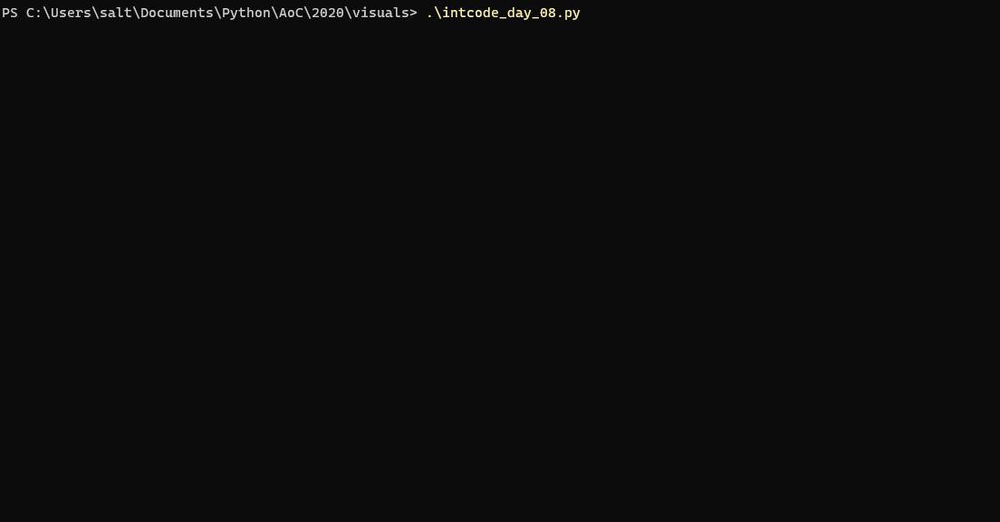
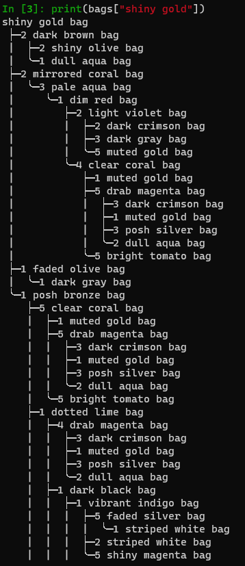
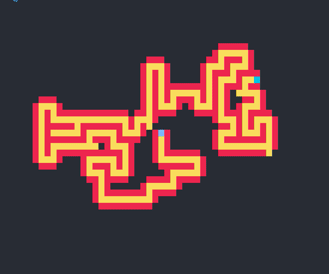

This repository is for sharing my Advent of Code solutions (or attempts) and visualizations.

Advent of Code is a yearly programming puzzle event. More info here: [Advent of Code - About](https://adventofcode.com/2019/about)

Many solutions use a fetch/submit helper that now lives in its own repository: https://github.com/salt-die/aoc_lube.

Several visualizations were created with my terminal graphics library, [nurses_2](https://github.com/salt-die/nurses_2).

# Terminal Visualizations

**Camp Cleanup, Day 4, 2022**

**Rock, Paper, Scissors, Day 2, 2022**

**Counting Calories, Day 1, 2022**

**Packet Printer, Day 16, 2021**

**Dumbo Octopuses, Day 11, 2021**

**Scrambled LED, Day 8, 2021**

**Submarine Commands, Day 2, 2021**

**Ocean Floor, Day 1, 2021**

**Intcode Callback, Day 8, 2020**

**Bag Pretty Printer, Day 7, 2020**

**Skiing, Day 3, 2020**

**Maze Solving in 2.5d, Day 15, 2019**

**Maze Solving Animation, Day 15, 2019**

**Breaker Animation, Day 13, 2019**

**Terminal Intcode Computer v2, Day 9, 2019**

