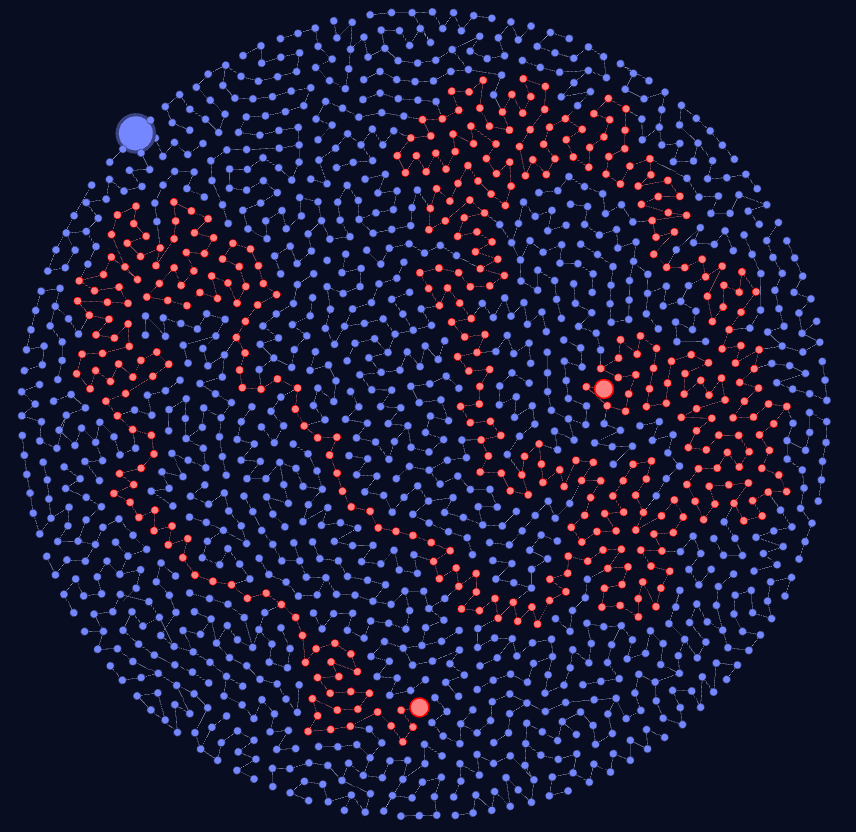
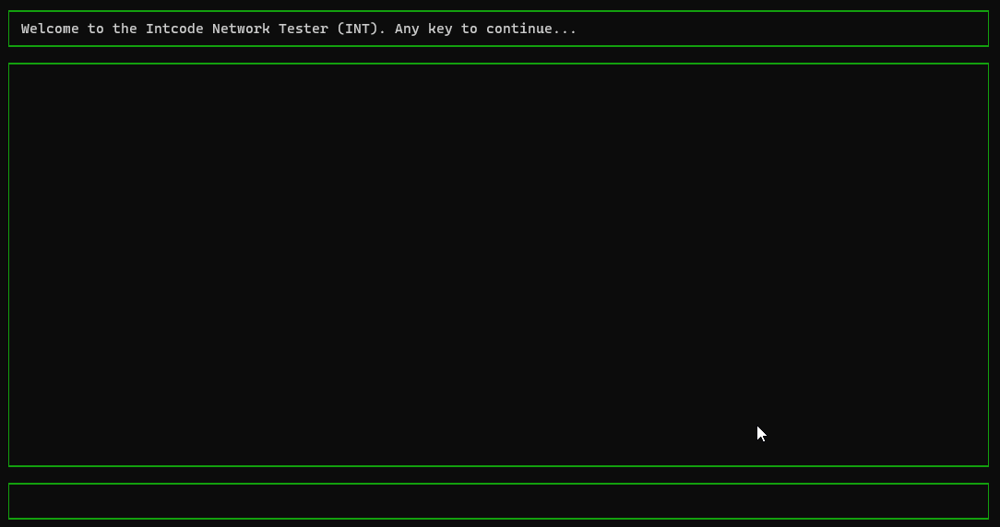

This repository is for sharing my Advent of Code solutions (or attempts).

Advent of Code is a yearly programming puzzle event.

More info here: [Advent of Code - About](https://adventofcode.com/2019/about)

**Terminal IntCode Computer, Day 5**

**Visualization of Day 6 Orbits:**

**Visualization of Day 7 Part 2 Network**

**Visualization of Incoming Transmission, Day 8**

**AOC19 in the form of Day 8 transmission**

**Terminal Intcode Computer v2, Day 9**

**Painting Robot Animation, Day 11**

**Breaker Animation, Day 13**

