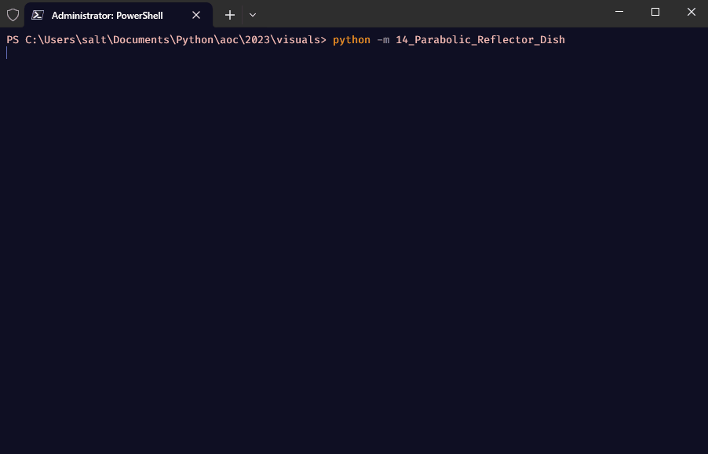
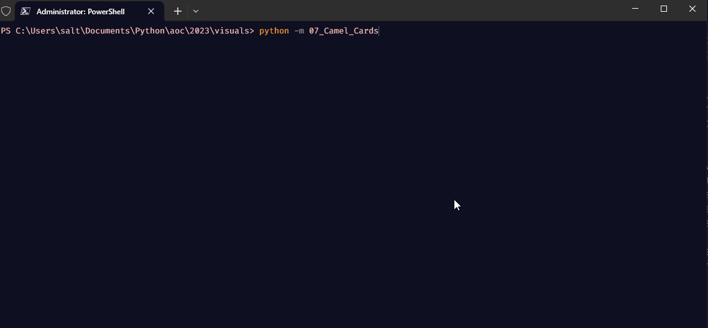
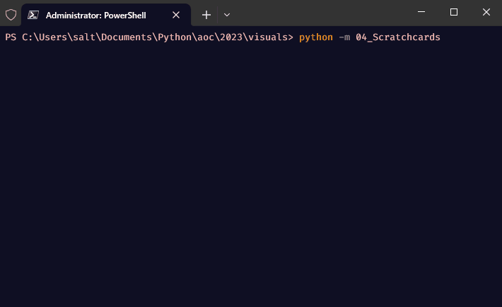
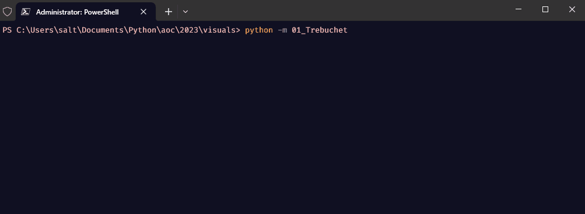
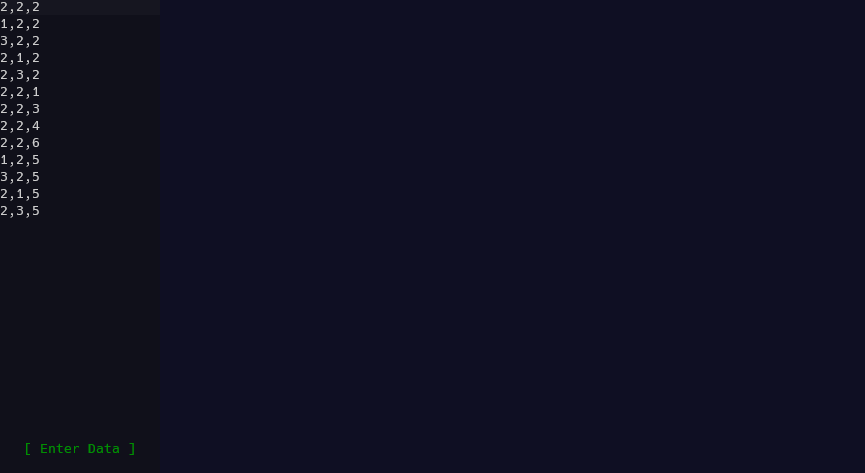
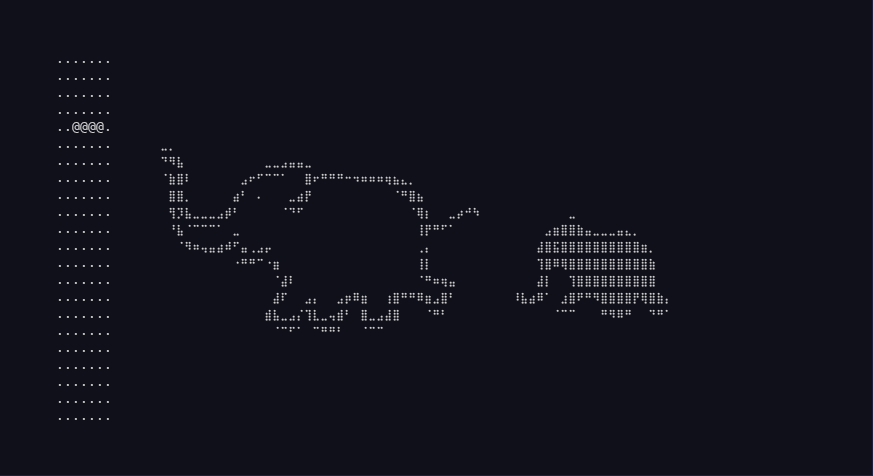
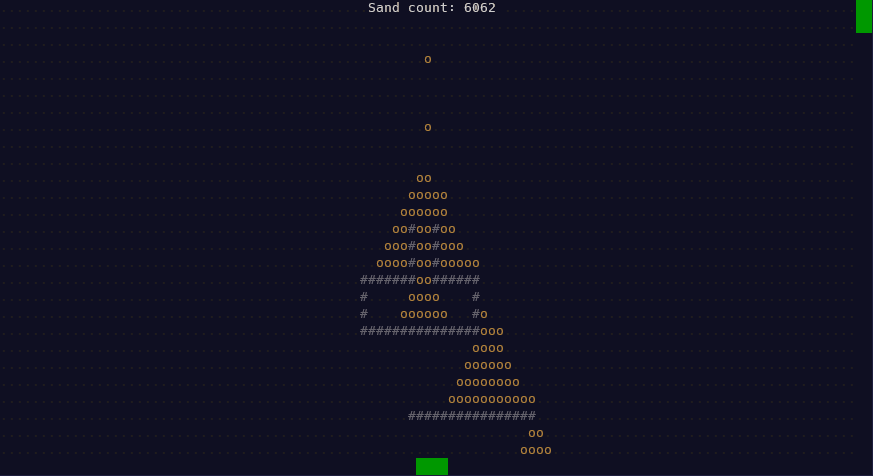

# Advent of Code

This repository is for sharing my Advent of Code solutions (or attempts) and visualizations.

Advent of Code is a yearly programming puzzle event. More info here: [Advent of Code - About](https://adventofcode.com/2019/about)

Many solutions use a fetch/submit helper that now lives in its own repository: [aoc_lube](https://github.com/salt-die/aoc_lube).

Several visualizations were created with my terminal graphics library, [batgrl](https://github.com/salt-die/batgrl).

## Terminal Visualizations

These are only a few of my visualizations. For more, check [visuals_media](visuals_media/) or search [adventofcode subreddit](https://www.reddit.com/r/adventofcode/) for "naclmolecule".

### Parabolic Reflector Dish, Day 14, 2023

### Camel Cards, Day 7, 2023

### Scratch Cards, Day 4, 2023

### Trebuchet?!, Day 1, 2023

### Lava Droplet, Day 18, 2022

### Tetrish, Day 17, 2022

### Regolith Reservoir, Day 14, 2022

### Rope Bridge, Day 9, 2022

### No Space No Space Left On Device, Day 7, 2022

### Supply Stacks, Day 5, 2022

### Counting Calories, Day 1, 2022

### Scrambled LED, Day 8, 2021

### Submarine Commands, Day 2, 2021

### Ocean Floor, Day 1, 2021

### Skiing, Day 3, 2020

### Maze Solving in 2.5d, Day 15, 2019

### Terminal Intcode Computer v2, Day 9, 2019

